================
Work in progress
================

.. |MO| replace:: :abbr:`MO (manufacturing order)`
.. |WIP| replace:: :abbr:`WIP (work in progress)`
.. |BOM| replace:: :abbr:`BoM (bill of materials)`
.. |MOs| replace:: :abbr:`MOs (manufacturing orders)`

Sometimes, manufacturing processes can take extended periods to complete before a product is ready
to be sold. In those cases, using *work in progress* (WIP) entries helps businesses accurately
reflect the value of partially completed goods in their financial statements.

Odoo **Manufacturing** allows users to post and reverse |WIP| entries associated with manufacturing
orders (MOs) to track the value of materials, labor, and overhead consumed while products are being
manufactured.

|WIP| tells your business where the cash is tied up in the manufacturing process at any given point.
These entry amounts are based on costs that *have already been incurred* during the manufacturing
process, not on planned or estimated costs.

.. note::
   |WIP| only applies to |MOs| that are in progress.

   :doc:`Landed Costs<../../../inventory_and_mrp/inventory/inventory_valuation/landed_costs>` and
   Costs of Goods Sold are not included in |WIP| because these factors are only relevant before or
   after the manufacturing process.

How WIP is calculated
=====================

Each component of |WIP| is derived from actual consumption recorded on the manufacturing order, not
from the bill of materials or planned costs.

The |WIP| value is calculated using the following equation:

.. math::

   \text{WIP} = \text{Direct Materials Consumed} + \text{Direct Labor Consumed} +
   \text{Overhead Consumed}

Terminology Breakdown in Odoo:

- Direct: The ability to trace a cost back to a specific |MO|.

- Consumed: What has actually been used in the manufacturing process so far.

- Overhead: The support costs of the manufacturing process. This is primarily captured via work
  center costs.

.. note::

   Because Odoo allows you to set an hourly rate by specific work center, indirect costs (e.g. work
   center machine electricity) become traceable because Odoo keeps track of usage.

For more information about how costing works in |MOs|:

- :doc:`Manufacturing order costs<../../../inventory_and_mrp/manufacturing/basic_setup/mo_costs>`

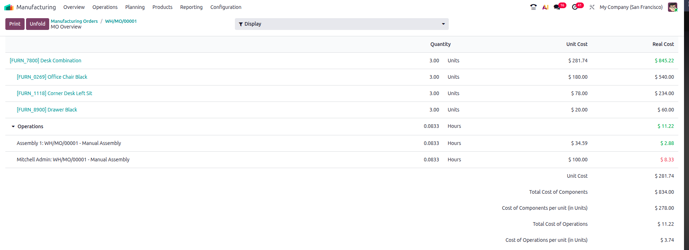

.. example::

   From the *MO Overview*, the *MO Cost* column represents planned costs, while *Real Cost* reflects
   actual incurred costs that feed into |WIP| entries.

   Material costs are reflected under the product and component lines. Labor and overhead costs are
   seen under the *Operations* lines.

Materials consumption
=====================

Consumption of materials is a key element in determining |WIP| values. To understand what this looks
like in Odoo, it's helpful to demonstrate through a bill of materials and |MO| Overview.

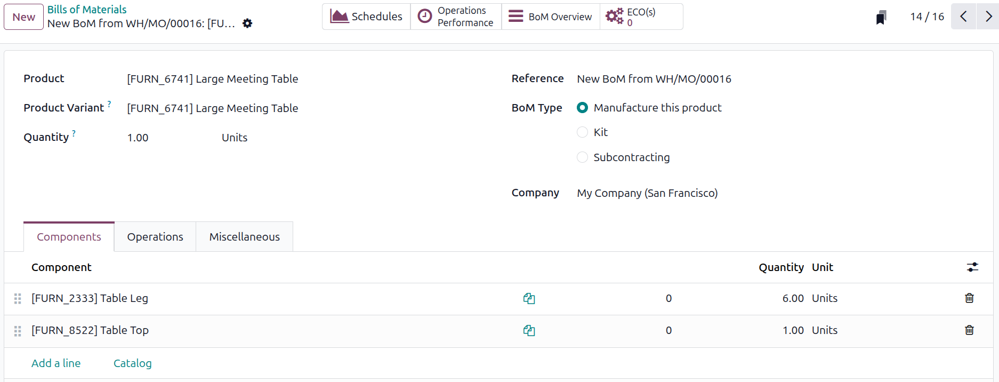

.. example::
   A bill of materials (BoM) is a preconfigured list of components needed to manufacture a product.
   Each component has an associated cost and quantity required for production.

.. seealso::

   - :ref:`Setting component costs <manufacturing/mo-costs/component-cost>`

To navigate to a |BOM|, start with :menuselection:`Manufacturing App --> Products --> Bill of
Materials`, then select :guilabel:`New` or click on an existing configuration.

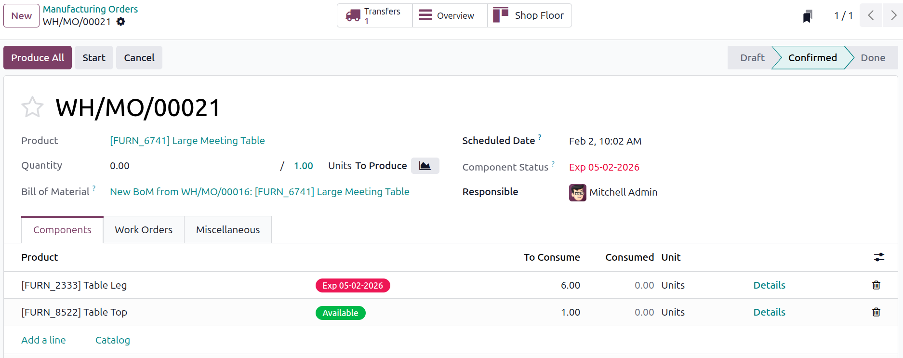

When a new manufacturing order is created, a |BOM| can be selected to populate the components needed
for production.

The column :guilabel:`To Consume` indicates the quantity of each component that needs to be consumed
for the order based on the |BOM|. The :guilabel:`Consumed` column shows how much of each component
has already been consumed for the order and is subject to change.

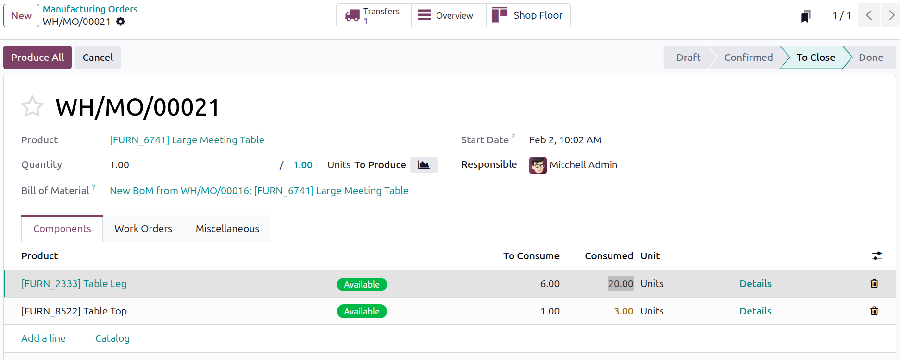

Consumed materials can be adjusted manually to reflect actual usage during the manufacturing
process.

.. tip::
    Materials can also be marked as consumed by employees via the **Shop Floor** app or by using
    barcode scanning.

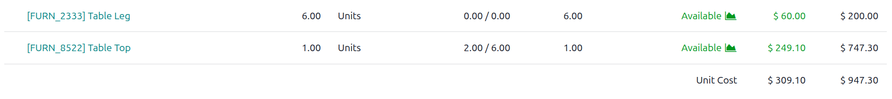

The |BOM| :guilabel:`Unit Cost` in this case is fixed at `$309.10` while the actual consumed
material cost reflected in the far right column shows `$947.30`.

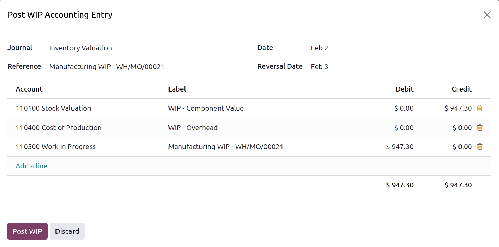

Initial |WIP| entries reflect consumed costs, not predicted or estimated costs.

.. note::
   The :guilabel:`WIP - Overhead` line item is `$0` to focus on the materials consumed. Typical
   manufacturing workflows will have overhead costs present.

Configuring WIP accounts
========================

To configure |WIP| accounts, navigate to :menuselection:`Settings App -->  Accounting --> Inventory
Valuation --> Manufacturing`.

From this view, the :guilabel:`Work In Progress Account` field displays the account used to track
the value of goods in progress. By default, Odoo sets this account to :guilabel:`110500 Work in
Progress`.

The :guilabel:`WIP Overhead Account` field shows the account used to track overhead costs associated
with |WIP|. By default, Odoo sets this account to :guilabel:`110400 Cost of Production`.

To change these accounts, click on the account names or use the :icon:`fa-caret-down` icon next to
the account names to either select another preconfigured account or create a new account.

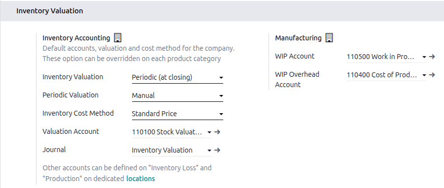
         Manufacturing configuration page.

WIP entries
===========

|WIP| entries are not automatically tied to MO progress. They reflect costs at the moment the entry
is posted, based on what has already been consumed. These entries are posted manually as needed.

Initial |WIP| entries are posted manually. This method allows for greater control and accuracy for
companies.

Making initial WIP entries
--------------------------

To post initial |WIP| entries, navigate to the relevant |MO| by clicking through
:menuselection:`Manufacturing App -->  Operations --> Manufacturing Orders`, then select the desired
existing order.

Locate the :icon:`fa-cog` icon next to the |MO| number. Clicking on the gear icon opens a dropdown
menu with various options.

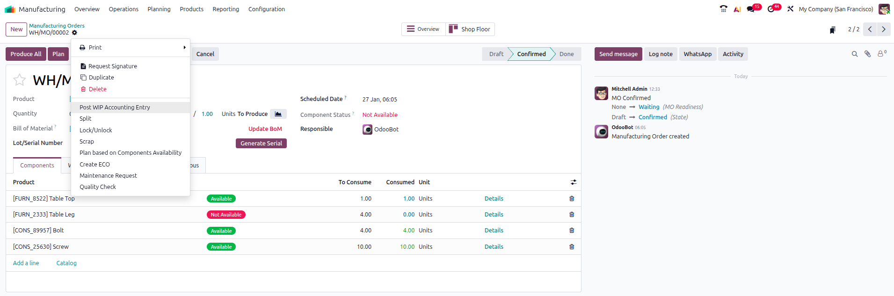

From the dropdown menu, select the :guilabel:`Post WIP Accounting Entry` option.

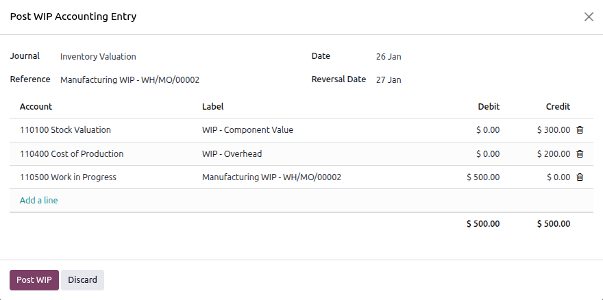

This will open a popup window where you can specify the date, journal, accounts, and amounts for the
|WIP| entry posting.

.. important::
    If you have posted a |WIP| entry and need to make updates, first reverse the existing |WIP|
    entry before posting a new one. This ensures that your financial records remain accurate and
    values are not misstated.

.. _manufacturing/basic_setup/work_in_progress/verify-wip-entries:

Verify WIP entries
------------------

Check your :guilabel:`Balance Sheet` report by clicking through :menuselection:`Accounting App -->
Reporting --> Balance Sheet` to ensure that |WIP| entries are being posted and reversed correctly.

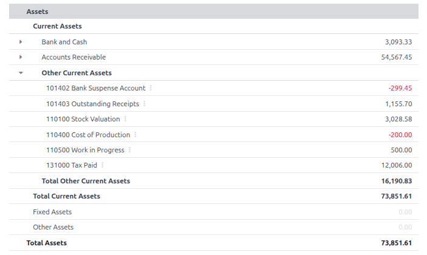

.. important::
   Verify that the specific period desired is selected by reviewing the :icon:`fa-calendar`
   :guilabel:`As of` smartbutton in the header ribbon

.. tip::
   |WIP| is classified as an inventory asset.

Reversing WIP entries
---------------------

|WIP| entries need to be reversed once the manufacturing process is complete. These entries are used
to temporarily reflect manufacturing consumption and need to be returned to an empty state in order
to be used again in another period. Users can manually reverse |WIP| entries if needed.

.. attention::

   By default, Odoo automatically schedules an action to reverse the initial |WIP| entries once they
   are posted. The automated reversal is set for the next day. The reversal day can be adjusted when
   posting the initial |WIP| entry.

To manually reverse |WIP| entries, navigate to the relevant |MO| by clicking through
:menuselection:`Manufacturing App -->  Operations --> Manufacturing Orders`, then select the
existing order needed.

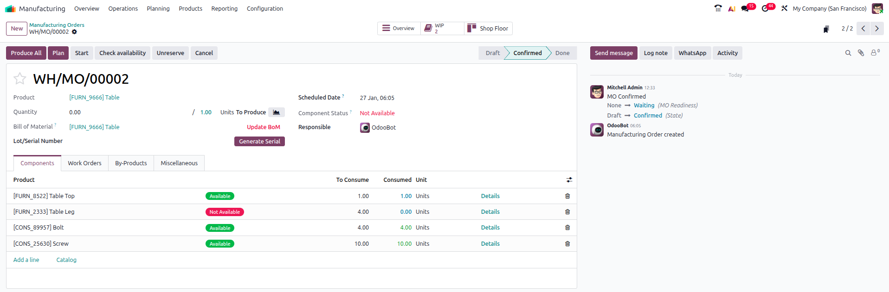

From the |MO|, click on the :guilabel:`WIP` smart button to view the |WIP| entries associated with
it.

This will open a new window displaying all |WIP| entries for that |MO|.

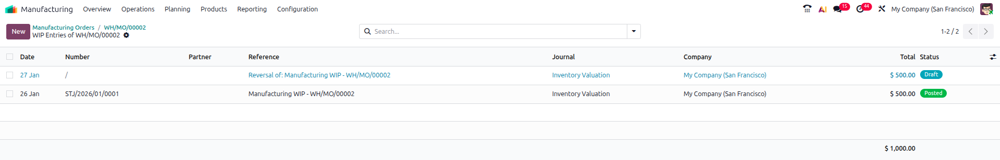

To reverse the initial |WIP| entry, select the reversal entry and click the :guilabel:`Confirm
Entries` button from the dropdown menu.

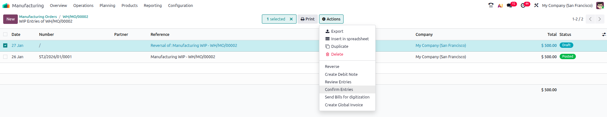

:ref:`Verify<manufacturing/basic_setup/work_in_progress/verify-wip-entries>` the reversal was posted
by reviewing the :guilabel:`Balance Sheet` report for that period.

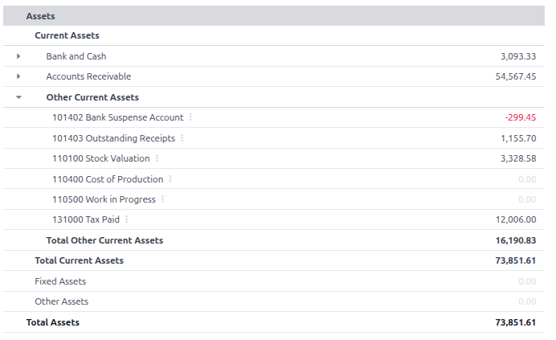

.. note::
   If the |WIP| entries do not appear as expected in the *Balance Sheet* report, double-check the
   dates and filters applied to ensure they align with the posting and reversal dates of the |WIP|
   entries.

