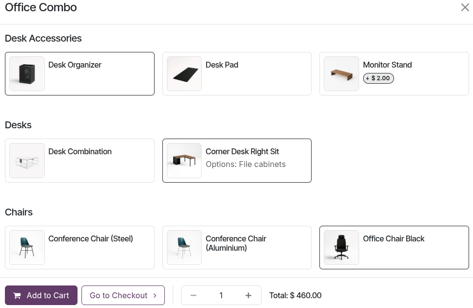
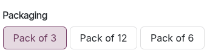

========
Products
========

Odoo eCommerce allows you to :ref:`create products <ecommerce/products/product-creation>` and
manage their :ref:`visibility <ecommerce/products/publish-products>`, offering a range of
customization options. Products can be :ref:`configured <ecommerce/products/product-configuration>`
by adding :ref:`product images and videos <ecommerce/products/images>`, creating :ref:`product
combinations <ecommerce/products/combos>`, implementing :ref:`cross-selling and upselling strategies
<ecommerce/products/cross_upselling>`, attaching :ref:`digital files
<ecommerce/products/digital-files>`, :ref:`translating <ecommerce/products/translation>`
product content, using :ref:`stock management tools <ecommerce/products/stock-management>`, and
selecting :ref:`packagings <ecommerce/products/stock-management/packagings>`.

.. _ecommerce/products/product-creation:

Product creation
================

To create a product from the frontend, go to the Website app, and click :guilabel:`New`
:icon:`fa-caret-down` in the top-right corner, then select :guilabel:`Product`. Enter the
:guilabel:`Product Name`, and other relevant details such as the :guilabel:`Barcode`,
:guilabel:`Sales Price`, default :guilabel:`Sales Taxes`, and a :ref:`Website Category
<ecommerce/categories_variants/categories>`, and add an image if needed. Once you click
:guilabel:`Save`, you are redirected to the product page where you can :ref:`customize it
<ecommerce_design/product_page/customization>` using the :doc:`website editor
</applications/websites/website/web_design>`. Additional advanced :ref:`product details
<ecommerce/products/product-configuration>` can be managed from the backend.

.. tip::
   It is also possible to create a product from the backend by navigating to
   :menuselection:`Website --> eCommerce --> Products`. Then:

   - Configure a new product by clicking :guilabel:`New`, or
   - :doc:`Import product data </applications/sales/sales/products_prices/products/import>`
     using XLSX or CSV files by clicking the :icon:`fa-cog` (:guilabel:`gear`) icon next to
     :guilabel:`Products`, then :ref:`Import records <essentials/export_import_data/import-data>`.

.. seealso::
   - :doc:`Create new products using the Barcode Lookup database
     </applications/inventory_and_mrp/barcode/setup/barcodelookup>`.
   - :doc:`Configure the Gelato connector in Odoo to synchronize the product catalog and automate
     order fulfillment with Gelato </applications/sales/sales/gelato>`.

Product visibility
==================

.. _ecommerce/products/publish-products:

To publish a product, access its frontend page by clicking the :icon:`fa-globe` :guilabel:`Go
to Website` smart button on the relevant product form or by locating it directly in the :doc:`shop
<../ecommerce_design/catalog>`. In the top-right corner, switch the toggle from
:guilabel:`Unpublished` to :guilabel:`Published`.

.. tip::
   To publish products from the backend, navigate to the :guilabel:`Sales` tab of the :ref:`product
   form <ecommerce/products/product-form>`, then go to the :guilabel:`Ecommerce shop` section and
   toggle the :guilabel:`Is Published` switch on.

To publish multiple products at once, follow these steps:

#. Go to :menuselection:`Website --> eCommerce --> Products`.
#. Remove the :guilabel:`Published` filter and switch to the :guilabel:`List` view.
#. Click the :icon:`fa-sliders` (:guilabel:`dropdown toggle`) icon on the far right of the view and
   enable :guilabel:`Is Published`.
#. Click the :guilabel:`Is Published` column to re-order it by *published* or *unpublished*
   products.
#. Select the products to publish by ticking their box on the far left.
#. In the :guilabel:`Is Published` column, tick the box for any of the selected products, then
   :guilabel:`Update` to publish them.

.. _ecommerce/products/website-availability:

.. note::
   When managing multiple websites, the availability of a product on each website can be set from
   the :ref:`product form <ecommerce/products/product-form>`. Navigate to the :guilabel:`Sales` tab,
   then in the :guilabel:`Ecommerce shop` section, select the :guilabel:`Website` where the product
   should be available. Leave the field blank to make the product available on *all* websites.
   You can make a product available on either *one* website or *all* websites, but selecting only
   *some* websites is not possible. To sell the product on multiple specific websites without
   making it available on all of them, **duplicate** the product for each website and assign the
   corresponding website to each duplicate.

.. _ecommerce/products/product-configuration:

Product configuration
=====================

.. _ecommerce/products/product-form:

To add general information to a product, navigate to :menuselection:`Website --> eCommerce -->
Products` and select the relevant product. You can configure various options, such as choosing a
:doc:`product type </applications/inventory_and_mrp/inventory/product_management/configure/type>`,
adding :doc:`variants and categories <categories_variants>`, or defining :doc:`prices <prices>`.

.. _ecommerce/products/description:

Additionally, add an e-commerce-specific product description to be displayed below the product name
on the frontend :doc:`product page <../ecommerce_design/product_page>`. To do so, go to the
:guilabel:`Sales` tab, scroll down to the :guilabel:`Ecommerce description` section, and write a
description. Use Odoo's :doc:`rich-text editor </applications/essentials/html_editor>` to customize
the content.

.. tip::
   - Click the :icon:`fa-globe` :guilabel:`Go to Website` smart button to access the frontend
     product page and :doc:`customize <../ecommerce_design/product_page>` it using the :doc:`website
     editor <../../website/web_design>`.
   - Product descriptions can also be generated using :doc:`AI </applications/productivity/ai>`. To
     do so, type `/` in the :guilabel:`Ecommerce description` section and select :guilabel:`AI` to
     open the chatbot window. Provide instructions for the desired description, then click
     :guilabel:`Use this` to apply it. The `/AI` option is available in various fields and sections.

.. _ecommerce/products/images:

Product images and videos
-------------------------

To add media items, such as images and videos, navigate to the :ref:`product form
<ecommerce/products/product-form>` and go to the :guilabel:`Sales` tab. In the :guilabel:`Ecommerce
Media` section, click :guilabel:`Add Media`. In the :guilabel:`Select a media` pop-up window:

- To add an image, go to the :guilabel:`Images` tab, select an image, click :guilabel:`Add URL` or
  :guilabel:`Upload an image`.
- To add a video, navigate to the :guilabel:`Videos` tab, paste a video URL or embed code.

Once the media is selected, click :guilabel:`Add`.

.. tip::
   :ref:`Customize product images and videos <ecommerce/product_page/image-customization>` using
   the :doc:`website editor <../../website/web_design>` from the frontend.

.. _ecommerce/products/combos:

Product combos
--------------

:doc:`Product combinations </applications/sales/point_of_sale/combos>` allow users to configure a
set of related products to buy as a bundle. To :ref:`configure combos <pos/combos/configuration>`,
go to :menuselection:`Website --> eCommerce --> Combo Choices`. Once finished and published,
customers can choose the combo when adding the product to the cart. Depending on the configuration,
certain items may incur an additional charge.

.. _ecommerce/products/cross_upselling:

Cross-selling & Upselling
-------------------------

Cross-selling and upselling are sales techniques used to present customers with additional or
higher-tier products and services from the :doc:`catalog
<../../ecommerce/ecommerce_design/catalog>`. Cross-selling focuses on recommending accessory or
:doc:`optional products </applications/sales/sales/sales_quotations/optional_products>` alongside
the item being purchased during ordering and checkout. Upselling, on the other hand, encourages
customers to choose a higher-priced or upgraded alternative product.

To configure those recommendations, go to :menuselection:`Website --> eCommerce --> Products`,
select a product, go to the :guilabel:`Sales` tab, and add the relevant products in the
corresponding :guilabel:`Optional products`, :guilabel:`Accessory Products`, and/or
:guilabel:`Alternative products` fields.

.. tabs::

   .. tab:: Optional products

      Optional products are suggested when the customer clicks the :guilabel:`Add to cart` button to
      buy a specific product.

      .. image:: products/suggest-optional-products.png
         :alt: Optional products cross-selling.

   .. tab:: Accessory products

      Accessory products appear in the :guilabel:`Suggested accessories` section during the
      :guilabel:`Order summary` step, just prior to proceeding to checkout.

      .. image:: products/accessory-products.png
         :alt: Suggested accessories at checkout during cart review

      .. note::
         To hide this section, open the :doc:`website editor <../../website/web_design>`, go to the
         :guilabel:`Style` tab, and toggle the :guilabel:`Suggested Accessories` switch off.

   .. tab:: Alternative products

      Alternative products are displayed at the bottom of the :doc:`product page
      <../ecommerce_design/product_page>` under the :guilabel:`Alternative Products` heading.

      .. image:: products/alternative-products-ecommerce.png
         :alt: The alternative products section of an product page.

      .. tip::
         To customize this block, open the :doc:`website editor <../../website/web_design>` and
         select the related :doc:`building block <../../website/web_design/building_blocks>`. In the
         :guilabel:`Style` tab, scroll to the :guilabel:`Alternative Products` section and modify
         the settings as needed.

.. _ecommerce/products/digital-files:

Digital files
-------------

It is possible to link digital files, such as certificates, eBooks, or user manuals, to the
products. To link a digital file to a product, go to the :ref:`product form
<ecommerce/products/product-form>` and click the :icon:`fa-file-text-o` :guilabel:`Documents` smart
button. Then click :guilabel:`Upload` to upload a file directly, or for additional options, click
:guilabel:`New`. Choose the :guilabel:`Type` of attachment:

- :guilabel:`File`: :guilabel:`Upload your file`.
- :guilabel:`URL`: Insert the link to the file or media item.
- :guilabel:`Cloud Storage` (if applicable): Insert a link to your cloud storage.

These documents can be made available:

- On the product page (before checkout): Enable the :guilabel:`Publish on website` option on the
  document form or card. Set the :guilabel:`Sales visibility` field to :guilabel:`Hidden`.
- In the :doc:`customer portal </applications/general/users/user_portals>` on the confirmed sales
  order (after checkout): Set the :guilabel:`Sales visibility` field to :guilabel:`On confirmed
  order` and turn off the :guilabel:`Publish on website` switch.

.. tip::
   Click the :icon:`fa-ellipsis-v` (:guilabel:`dropdown menu`) in the top-right corner of the
   document card to :guilabel:`Edit`, :guilabel:`Delete`, or :guilabel:`Download` the document.

.. _ecommerce/products/translation:

Translation
-----------

If a website is available in multiple languages, product information can be translated directly on
the :ref:`product form <ecommerce/products/product-form>`. Fields that support multiple languages
are identifiable by their language abbreviation (e.g., `EN`) next to the field, such as the
:guilabel:`Product name`, :ref:`Out-of-Stock Message <ecommerce/products/stock-management>`, the
:ref:`E-Commerce Description <ecommerce/products/description>`, :ref:`ribbon or badge
<ecommerce/products/additional_features/product-highlight>` names, :doc:`categories and variants
<categories_variants>` names, etc.

.. note::
   Having untranslated content on a web page may be detrimental to the user experience and
   :doc:`SEO </applications/websites/website/structure/seo>`. To avoid this, use the
   :ref:`Translate <translate/translate>` feature to translate the page's content.

.. seealso::
   :doc:`Website translations </applications/websites/website/configuration/translate>`

.. _ecommerce/products/stock-management:

Stock management
----------------

.. important::
   The :doc:`Inventory app </applications/inventory_and_mrp/inventory>` must be installed to handle
   stock-related settings and operations.

To ensure that e-commerce sales stay aligned with the inventory available in the warehouse,
configure the inventory management options. To do so, navigate to go to :menuselection:`Website -->
Configuration --> Settings`, scroll down to the :guilabel:`eCommerce` section, then to the
:guilabel:`Inventory Defaults` subsection. Configure the following stock-related options, if needed:

- Next to :guilabel:`Out-of-Stock`, enable :guilabel:`Continue Selling` to allow customers to place
  orders even when the product is out of stock. Leave this option disabled to prevent orders for
  unavailable products.
- Enable the :guilabel:`Show Available Quantity` option to display the remaining available quantity
  on the product page when it falls below a defined threshold. The available quantity is calculated
  based on the :guilabel:`On hand` quantity minus the quantity already :doc:`reserved
  </applications/inventory_and_mrp/inventory/shipping_receiving/reservation_methods>` for outgoing
  transfers.

These settings apply to *all* products, but can still be adapted individually on the product form.
To do so, go to the product form and navigate to the :guilabel:`Sales` tab. Under the
:guilabel:`Ecommerce shop` section, enable or disable the relevant :guilabel:`Sell when
Out-of-Stock` and :guilabel:`Show Available Qty` options. You can also compose an
:guilabel:`Out-of-Stock Message` or create an
:ref:`out-of-stock ribbon or badge <ecommerce/products/additional_features/product-highlight>`.

.. note::
   - Enabling/disabling the general :guilabel:`Inventory Defaults` settings does not automatically
     (un)tick checkboxes on the product form for existing products; it only affects new products
     created after the feature is turned on/off.
   - To use the stock-related features under the :guilabel:`Sales` tab of the product form and to
     have the notification option available, the :ref:`Track inventory setting
     <inventory/product_management/tracking-inventory>` must be enabled on the product form.
   - To display the stock level on the product page, the :guilabel:`Product Type` field on the
     :ref:`product form <ecommerce/products/product-form>` must be set to :guilabel:`Goods` or
     :guilabel:`Combo`.
   - A :icon:`fa-envelope-o` (:guilabel:`envelope`) :guilabel:`Get notified when back in stock`
     button appears on the product page when an item is out of stock. Customers can click
     the link to enter their email address and receive a notification once the item is back
     in stock.
   - Use the :ref:`Click & Collect <ecommerce/shipping/instore-pickup>` feature to display the
     product availability on the product page.

.. example::
   Currently, the `Boko Chair` is not available in any warehouses. However, customers can click
   the :icon:`fa-envelope-o` (:guilabel:`envelope`) :guilabel:`Get notified when back in
   stock` link to receive a notification as soon as the product becomes available again. An
   :guilabel:`Out-of-Stock Message` can also be added to inform customers that the item will be
   replenished.

   .. image:: products/out-of-stock.png
      :alt: Example of a product that is out of stock, but which will be available again.

.. tip::
   If a unique reference is needed for inventory management, install the :doc:`Manufacturing app
   </applications/inventory_and_mrp/manufacturing>`, and create :doc:`Kit bills of materials
   </applications/inventory_and_mrp/manufacturing/advanced_configuration/kit_shipping>`. Each
   kit links its published "virtual" products to the main reference tracked in Inventory. This
   ensures that any item sold on the website is converted into the corresponding stocked item in
   the delivery order.

.. _ecommerce/products/stock-management/packagings:

Packagings
~~~~~~~~~~

To offer different product pack sizes to customers on the e-commerce, configure product
:doc:`packagings
</applications/inventory_and_mrp/inventory/product_management/configure/packaging>`. Then go to
the :ref:`product form <ecommerce/products/product-form>` and navigate to the
:guilabel:`Sales` tab. Under :guilabel:`Upsell & cross-sell`, add as many package types as needed
in the :guilabel:`Packagings` field. The available package types are displayed on the e-commerce
:doc:`product page <../ecommerce_design/product_page>`.

.. tip::
   It is also possible to add packagings to a specific :ref:`product variant
   <ecommerce/categories_variants/product-variants>`. To do so, go to the product form, click the
   :icon:`fa-sitemap` :guilabel:`Variants` :ref:`smart button
   <products/variants/variants-smart-button>`, and select the relevant product variant. Under
   :guilabel:`Sales`, add as many package types as needed in the :guilabel:`Packagings` field.
